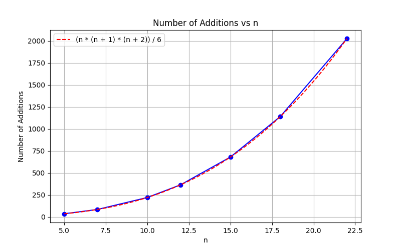

Εξαντλητική αναζήτηση / Brute force
===

Σε αυτό το κεφάλαιο θα δούμε πώς η πλοιοψηφία των προβλημάτων σε διαγωνισμούς πληροφορικής μπορούν να λυθούν μέσω κάποιας **εξαντλητικής μεθόδου** (*brute force*)

Έτσι, θα προσπαθήσουμε να "τυποποιήσουμε" τον τρόπο που γράφουμε μία *brute force* λύση

Αργότερα θα δούμε ότι συχνά  υπάρχουν πιο αποδοτικές λύσεις. Παρ'όλα αυτά η εξαντλητική προσέγγιση αποτελεί μια αξιόπιστη βάση μέσω της οποίας μπορούμε να οδηγηθούμε στην επιθυμιτή λύση

---

Στο προηγούμενο κεφάλαιο είδαμε πως μπορούμε να επεξεργαζόμαστε ένα ένα τα στοιχεία ενός πίνακα για να ελέγξουμε αν εμφανίζεται κάποιο στοιχείο, να υπολογίσουμε το άθροισμα τους και πολλά άλλα

Ωστόσο υπάρχουν προβλήματα για τα οποία δεν αρκεί να εξετάσουμε κάθε στοιχείο ξεχωριστά, αλλά χρειάζεται να εξετάσουμε όλες τις δυνατές πλειάδες στοιχείων (είτε ζευγάρια είτε τριάδες... ανάλογα με το πρόβλημα)  

## Πρόβλημα: [2Sum](https://leetcode.com/problems/two-sum/description/)

Δεδομένου πίνακα `nums` που αποτελείται από *n* στοιχεία και ενός ακεραίου `target` μας ζητείται να βρούμε αν υπάρχουν δύο στοιχεία του πίνακα που έχουν άθροισμα ίσο με `target`  

Παράδειγματα: 

$$target = 9, nums = [1, {\color{red} 5}, 2, {\color{red} 4}, 4, 6] \rightarrow True$$

$$target = 5, nums = [1, 3, 3, 8, 6] \rightarrow False $$

### Λύση💡

Aν με κάποιον τρόπο γνωρίζαμε το πρώτο από τα δύο στοιχεία που μας ζητείται να επιλέξουμε, έστω αυτό είναι το `nums[i]`, θα μπορούσαμε να εκτελέσουμε τον αλγόριθμο γραμμικής αναζήτησης για να ελέγξουμε αν κάποιο από τα επόμενα στοιχεία συμπληρώνει το άθροισμα που θέλουμε να δημιουργήσουμε.

Άρα αν θεωρήσουμε την θέση `i` όπου βρίσκεται το πρώτο στοιχείο γνωστή:

``` c++
bool found = 0;
for(int j = i+1; j < n; j++)
    if(nums[i] + nums[j] == target)
        found = 1;
```

Πώς όμως θα επιλέξουμε την θέση *i*?

Μπορούμε να δοκιμάσουμε κάθε πιθανή θέση *i*, δηλαδή να ελέγξουμε για κάθε *i* από 0 εώς *n-1* αν ο παραπάνω αλγόριθμος βρίσκει λύση:

``` c++
bool found = 0;
for(int i = 0; i < n; i++){
    //We fix nums[i] as our first element
    //Check if there exists a suitable second element
    for(int j = i+1; j < n; j++)
        if(nums[i] + nums[j] == target)
            found = 1;
}
```

Με τον παραπάνω τρόπο θέλουμε να έχουμε ελέγξει όλα τα πιθανά ζευγάρια στοιχείων. Πράγματι αν προσθέσουμε στο εσωτερικό *for loop* την εντολή `cout << "(" << i << ", " << j << ") "` για να δούμε ποιά ζευγάρια ελέγξαμε,

για $n = 5$ παίρνουμε έξοδο:

``` c++
(0, 1) (0, 2) (0, 3) (0, 4)
(1, 2) (1, 3) (1, 4)
(2, 3) (2, 4)
(3, 4)
```

### Προβληματισμοί 🔎
- Για έναν πίνακα n στοιχείων, πόσα ζευγάρια υπάρχουν?
- Πόσες τριάδες και γενικότερα, πόσες k-άδες υπάρχουν?

## Πρόβλημα: [maxSubarraySum](https://leetcode.com/problems/maximum-subarray/description/)

Δεδομένου πίνακα `a` με `n` ακεραίους βρείτε τον υποπίνακα με το μεγαλύτερο άθροισμα. Επιστρέψτε το άθροισμα αυτό

> Υποπίνακα ονομάζουμε μία **συνεχή**, μη κενή ακολουθεία που περιέχεται στον πίνακα

Παραδείγματα:

$$a = [-2,1,-3,{\red {4,-1,2,1}},-5,4] \rightarrow 6$$

$$a = [\red{5,4,-1,7,8}] \rightarrow 23$$

### Λύση 💡

Μπορούμε με κάποιο τρόπο να εξετάσουμε όλους τους υποπίνακες του `a`?

Παρατηρούμε ότι κάθε υποπίνακας χαρακτηρίζεται μοναδικά από τις θέσεις του πρώτου και του τελευταίου στοιχείου του

Για παραδειγμά, έστω $a = [5,4,-1,7,8]$, ο υποπίνακας του $a$ με πρώτο στοιχείο στην θέση $1$ και τελευταίο στοιχείο στην θέση $3$ είναι ο $[4,-1,7]$

Μπορούμε λοιπόν να διατρέχουμε όλα τα ζευγάρια στοιχείων $(l, r)$ όπως είδαμε σε προηγούμενο πρόβλημα. 

Έχοντας "παγώσει" *(fix)* ένα ζευγάρι, χρειάζεται να βρούμε το άθροισμα του διαστήματος στο οποίο αντιστοιχεί. 

Ο ευκολότερος τρόπος να βρίσκουμε το άθροισμα είναι να προσθέτουμε ένα ένα όλα τα στοιχεία του διαστήματος $[l, l+1, \dots ,  r-1, r]$

Συνολικά:
``` c++
long long bestSum = a[0];
for(int i = 0; i < n; i++){
    //Allow i = j since [i, i] is a valid segment of one element
    for(int j = i; j < n; j++){
        //Calculate sum of current segment
        long long sum = 0;
        for(int k = i; k <= j; k++)
            sum += a[k];
        //Update best sum
        if(sum > bestSum)
            bestSum = sum;
    }
}
```
> Για ποιό λόγο η τιμή bestSum αρχικοποιείται με την τιμή a[0]?
> 
> Θα υπήρχε πρόβλημα αν θέσουμε αρχικά `bestSum = 0`


### Αριθμός προσθέσεων

Ας ελέγξουμε πόσες προσθέσεις εκτελεί ο παραπάνω αλγόριθμος για $n = 5$:

- Υπάρχουν 5 διαστήματα $[0, 0], [1, 1], \dots [4, 4]$ που περιέχουν 1 στοιχείο
- Υπάρχουν 4 διαστήματα $[0, 1], \dots [3, 4]$ που περιέχουν 2 στοιχεία
- $\dots$

Συνολικά θα πραγματοποιηθούν $5 + 4 \cdot 2 + 3 \cdot 3 + 2 \cdot 4 + 5 = 35$ προσθέσεις

Για να ελέγξουμε τον αριθμό των προσθέσεων που θα πραγματοποιηθούν για μεγαλύτερες τιμές του $n$ μπορούμε να εισάγουμε έναν μετρητή `cnt` ο οποίος θα αυξάνεται κάθε φορά που προσθέτουμε κάποιο νέο στοιχείο

Ο παρακάτω πίνακας και η αντίστοιχη γραφική παράσταση απεικονίζουν τον αριθμό των προσθέσεων που πραγματοποιούνται για διαφορετικές τιμές του $n$:

| $n$       | 5   | 7   | 10  | 12  | 15   | 18    | 22    |   
|-----------|-----|-----|-----|-----|------|-------|-------|
|Προσθέσεις | 35  | 84  | 220 | 364 | 680  | 1140  | 2024  | 



Όπως φαίνεται στην γραφική παράσταση ο αριθμός των προσθέσεων προκύπτει: $cnt(n) = \frac{n(n+1)(n+2)}{6}$ (η αυστηρή απόδειξη αφήνεται σε εσάς)

Στο επόμενο κεφάλαιο (reference πολυπλοκότητα) θα αναφέρουμε ότι ο παραπάνω αλγόριθμος έχει πολυπλοκότητα $Θ(n^3)$, θα εξηγήσουμε γιατί παραλείπουμε τους υπόλοιπους όρους και συντελεστές του $cnt(n)$

Υπάρχει κάποιος τρόπος να ελαττώσουμε τον αριθμό των απαραίτητων προσθέσεων?

### Βελτίωση 💡

Παρατηρούμε ότι δύο διαστήματα της μορφής $[i, j], [i, j+1]$ διαφέρουν μόνο κατά ένα στοιχείο

Επομένως, αν έχουμε ήδη υπολογίσει το άθροισμα του διαστήματος $[i, j]$, για να υπολογίσουμε το άθροισμα του επόμενου διαστήματος αρκεί να προσθέσουμε σε αυτό, το στοιχείο $a[j+1]$

Για να εκμεταλλευτούμε την παραπάνω ιδιότητα, αρκεί να επεξεργαζόμαστε τα διαστήματα με την ίδια απλή σειρά, όπως και στην προηγούμενη λύση

Συγκεκριμένα, κάθε φορά που:
- Μεταβάλλουμε το δεξί άκρο του διαστήματος, δηλαδή προχωράμε τον δείκτη `j` μια θέση δεξιά, προσθέτουμε στο τρέχων άθροισμα την τιμή `a[j]` του νέου στοιχείου που εισάγουμε

- Μεταβάλλουμε το αριστερό άκρο του διαστήματος, δηλαδή προχωράμε τον δείκτη `i` μια θέση δεξιά, μηδενίζουμε το τρέχων άθροισμα αφου αναφερόμαστε προσωρινά σε άδειο διάστημα

``` c++
long long bestSum = a[0], curSum = 0;
for(int i = 0; i < n; i++){
    //We just moved i, so reset curSum
    curSum = 0;
    for(int j = i; j < n; j++){
        //We just moved j, so add a[j] to curSum
        curSum += a[j];
        //Update best sum
        if(sum > bestSum)
            bestSum = sum;
    }
}
```
Εφόσον εκτελούμε μία πρόσθεση για κάθε νέο διάστημα που εξετάζουμε, ο αριθμός των προσθέσεων ταυτίζεται με το πλήθος των διαστημάτων. Συνεπώς ο νέος αλγόριθμος χρησιμοποιεί $\frac{n(n+1)}{2}$ προσθέσεις και λέμε ότι έχει πολυπλοκότητα $Θ(n^2)$

### Χρήσιμες ιδέες 💭

- Ένας πίνακας $n$ στοιχείων περιέχει $\frac{n(n+1)}{2}$ υποπίνακες. Κάθε υποπίνακας αντιστοιχεί σε μοναδικό ζευγάρι ακεραίων $(l, r), 0 \leq l \leq r < n$, όπου $l$ η θέση του πρώτου στοιχείου που περιλαμβάνεται στον υποπίνακα και $r$ η θέση του τελευταίου στοιχείου

- Συχνά η ποσότητα που χρειάζεται να υπολογίσουμε για κάποιο διάστημα $(l, r)$ μπορεί να προκύψει εύκολα συνδιάζοντας τα αποτελέσματα του εθυλακωμένου διαστήματος $(l, r-1)$ με την νέα τιμή $a[r]$

### Προβληματισμοί 🔎

- Μπορείτε να βρείτε μία ακόμα πιο αποδοτική λύση που απαιτεί γραμμικό αριθμό προσθέσεων? (Αν παγώνουμε το δεξί άκρο του διαστήματος, μπορούμε κάπως να βρίσκουμε γρήγορα ποιό αριστερό άκρο θα έδινε το μεγαλύτερο άθροισμα?)


3:50