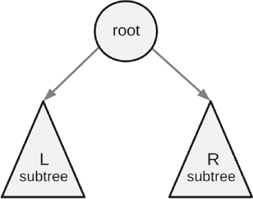
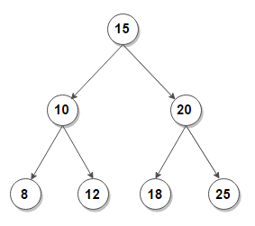

Ισορροπημένα δυαδικά δέντρα αναζήτησης
====
***Μανώλης Χατζηγεωργίου***

Σε αυτή την ενότητα θα ορίσουμε την δομή ενός **δυαδικού δέντρου αναζήτησης (binary search tree)**, θα εξετάσουμε προβλήματα όπου μπορεί να φανεί χρήσιμη αλλά και τους περιορισμούς που εμφανίζει μια απλή υλοποίηση της. Για να υπερβούμε αυτούς τους περιρισμούς, θα ενισχύσουμε την δομή με έναν μηχανισμό **αύτο-ισορρόπησης (self balancing)**. Τέλος θα εξοικειωθούμε με έτοιμες δομές της *STL* που προσφέρουν τις λειτουργίες ενός ισορροπημένου δυαδικού δέντρου αναζήτησης και θα ερευνήσουμε τις δυνατότητες που μας προσφέρουν μέσα από προβλήματα

## Δυαδικά δέντρα

Δυαδικό δέντρο ορίζουμε μια δενδρική δομή δεδομένων στην οποία κάθε κόμβος έχει το πολύ δύο παιδιά, σχηματικά: 

> Λέμε ότι το $1$ είναι η **ρίζα** του δέντρου 

Βλέπουμε ότι κάθε κόμβος ακολουθεί την παρακάτω δομή. 

> Ως **υπόδεντρο** (subtree) ενός κόμβου $sub(x)$ ορίζουμε το σύνολο των κόμβων που περιέχει το $x$ και κάθε άλλο κόμβο που βρίσκεται κάτω από το $x$

Για να είναι ένα δυαδικό δέντρο, δυαδικό δέντρο **αναζήτησης** θα πρέπει για κάθε κόμβο $x$, κάθε στοιχείο που ανήκει στο αριστερό υπόδεντρο (αν υπάρχει) να έχει τιμή μικρότερη ή ίση αυτού ενώ κάθε στοχείο του δεξιού υπόδεντρου (αν υπάρχει) να έχει τιμή μεγαλύτερη ή ίση, δηλαδή:

$$ val[l] \leq val[x] \leq val[r] \; \forall \; l \in sub(x_{left}), \; r \in sub(x_{right})$$

Ένα παράδειγμα δυαδικού δέντρου αναζήτησης:

> Για τον κόμβο με τιμή $3$ κάθε στοιχείο στο αριστερό του υπόδεντρο $sub(left) = \{1\}$ είναι $\leq 3$ ενώ κάθε στοιχείο του δεξιού υπόδεντρου $sub(right) = \{4,6,7\}$ είναι $\geq 3$. Μπορείτε να ελέγξετε ότι κάθε άλλος κόμβος ικανοποιεί την ιδιότητα

Ένα δυαδικό δέντρο αναζήτησης υποστηρίζει $3$ βασικές λειτρουργίες:
1. Αναζήτηση 
2. Προσθήκη 
3. Αφαίρεση

### Αναζήτηση σε δυαδικό δέντρο αναζήτησης

Ένας τρόπος να ελέγξουμε αν η τιμή $x$ εμφανίζεται σε κάποιο κόμβο του δέντρου είναι να εξετάσουμε κάθε κόμβο. Ξεκινόντας από την ρίζα του δέντρου ελέγχουμε αν η τιμή της ταυτίζεται με το στοιχείο που ψάχνουμε, έπειτα αναζητούμε στο αριστέρο και δεξί υπόδεντρο της.

Παρατηρούμε όμως ότι ποτέ δεν χρειάζεται να εξετάζουμε και τα δύο υπόδεντρα. Συγκεκριμένα, ελέγχουμε αρχικά την ρίζα:
- Αν η τιμή που ψάχνουμε ταυτίζεται με αυτή της ρίζας, απαντάμε ότι βρήκαμε το στοιχείο που ψάχναμε και η διαδικασία τελειώνει εκεί  
- Αν η τιμή που ψάχνουμε είναι μικρότερη της τιμής της ρίζας, **δεν** έχει νόημα να αναζητήσουμε δεξιά της αφου όλες οι τιμές του δεξιού υπόδεντρου είναι ακόμα μεγαλύτερες, άρα συνεχίζουμε την αναζήτηση μόνο στο αριστερό υπόδεντρο
- Αν η τιμή που ψάχνουμε είναι μεγαλύτερη της τιμής της ρίζας, αντίστοιχα, συνεχίζουμε την αναζήτηση μόνο στο δεξί υπόδεντρο

Για να εκφράσουμε το πλήθος των αναζητήσεων που χρειαζόμαστε, ορίζουμε ως **ύψος** του δέντρου, την μέγιστη απόσταση της ρίζας από κάποιον κόμβο

Στην χειρότερη περίπτωση, το στοιχείο που αναζητούμε βρίσκεται στην χαμηλότερη θέση του δέντρου ή χρειάζεται να φτάσουμε μέχρι εκείνη για να συμπεράνουμε ότι δεν υπάρχει

Συνεπώς, εστω $h$ το ύψος του δέντρου, η αναζήτηση στοιχείου έχει πολυπλοκότητα $O(h)$

### Προσθήκη

Θεωρούμε ως ελεύθερες θέσεις, τα μη συμπληρωμένα παιδιά όλων των κόμβων. Π.χ. στο παραπάνω δέντρο, η θέση αριστερά του κόμβου με τιμή $10$ είναι ελεύθερη

Για να προσθέσουμε κάποιο νέο στοιχείο στο δέντρο εντοπίζουμε μία ελεύθερη θέση στην οποία μπορεί να τοποθετηθεί **ώστε να διατηρείται η ιδιότητα του δέντρου αναζήτησης** (όπως εργαστήκαμε για την αναζήτηση σε χρόνο $O(h)$) και το συνδέουμε κατάλληλα με τον γονέα του (σε $O(1)$)

### Ελαχιστοποιόντας το ύψος

Βλέπουμε ότι οι περισσότερες λειτουργίες ενός δυαδικού δέντρου αναζήτησης απαιτούν χρόνο ανάλογο του ύψους του. Παρακάτω θα προσπαθήσουμε να απαντήσουμε στης εξής ερωτήσεις: 
- Πόσο μεγάλο μπορεί να γίνει στην χειρότερη περίπτωση το ύψος του δέντρου? 
- Πόσο μικρό μπορεί να είναι στην καλύτερη περίπτωση? 
- Υπάρχει τρόπος να διατηρούμε το ύψος κοντά στην ελάχιστη τιμή του?

#### Χειρότερη περίπτωση (skewed tree)

Ας εξετάσουμε την δομή του δέντρου, αν ξεκινόντας από ένα κενό σύνολο, εισάγουμε τα στοιχεία $[10, 20, 30, 40, 50]$ με την σειρά που εμφανίζονται. Μετά την τελευταία προσθήκη, το δέντρο θα έχει την εξής μορφή:

Λέμε ότι το δυαδικό δέντρο είναι δεξιά **λοξό (right skewed)**. Στην περίπτωση ενός λοξού δέντρου, ισχύει $h = n-1$, όπου $h$ το ύψος του δέντρου και $n$ το πλήθος των στοιχείων

#### Βέλτιστη περίπτωση (perfect tree)

Αν πάλι ξεκινήσουμε από ένα κενό σύνολο και εισάγουμε τα στοιχεία $[15, 10, 8, 12, 20, 18, 25]$ με την σειρά που εμφανίζονται:

Λέμε ότι το δυαδικό δέντρο είναι **τέλειο (perfect)** διότι κάθε επίπεδο του είναι γεμάτο. Ας εξετάσουμε την σχέση του ύψους και του πλήθους στοιχείων ενός τέλειου δέντρου. Αν ένα τέλειο δέντρο έχει ύψος $h$ τότε κάθε ένα από τα $h$ επιπεδά του είναι γεμάτο. Οι χωριτικότητες των επιπέδων του είναι $1, 2, 4, 8, \dots, 2^{h-1}$, συνολικά το δέντρο θα έχει $n = 1+2+ \dots + 2^{h-1} = 2^h-1$  