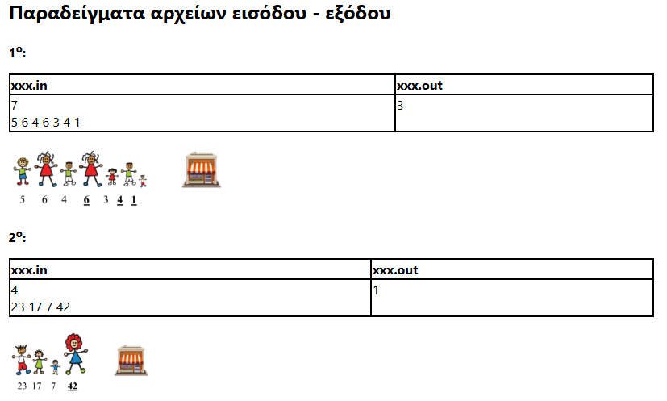

LINEAR SCAN / COMPLETE SEARCH

Usual linear search, running sum/min/max
Iterate forward, backward, with step, ...

https://cses.fi/problemset/task/1069
https://pdp-archive.github.io/27-PDP/a-xxx-statement
https://pdp-archive.github.io/28-PDP/camp-j-metoxes2-statement

Can be extended for pairs (i, j), triplets(i, j, k)..., iterating over all nC2, nC3...

2Sum O(n^2) https://pdp-archive.github.io/26-PDP/c-sumpair-statement
https://leetcode.com/problems/island-perimeter/description/

Προαπαιτούμενα: Μεταβλητές, Conditionals, βασικά πινάκων

Δεδομένου ένος πίνακα *n* αριθμών, συχνά αρκεί να εξετάσουμε κάθε στοιχείο του πίνακα από μία φορά για να απαντήσουμε σε κάποια βασική ερώτηση.

Για παράδειγμα αν χρειάζεται να βρούμε το άθροισμα των στοιχείων πίνακα *a*:

``` c++
int sum = 0;
for(int i = 0; i < n; i++)
    sum += a[i];
```

Για να αναφερθούμε σε κάθε στοιχείο του a χρησιμοποιηούμε την μεταβλητή *i* που λειτουργεί ως **δείκτης** (index).

Ο δείκτης αρχικοποιείται με την τιμή 0 καθώς αυτή είναι η θέση του πρώτου στοιχείου και αυξάνεται κατά 1 όσο δεν έχει ξεπεράσει το τελευταίο στοιχείο που βρίσκεται στην θέση *n-1*

Σε αρκετά προβλήματα χρειάζεται να εξετάσουμε τα στοιχεία με συγκεκριμένη σειρά. 
Για παράδειγμα αν χρειάζεται να διατρέξουμε τον πίνακα από τα δεξιά προς τα αριστερά:

``` c++
for(int i = n-1; i >= 0; i--) 
    cout << a[i] << " ";
```

Αν χρειάζεται να διατρέξουμε τα στοιχεία στις θέσεις 0, 2, 4, ...

``` c++
for(int i = 0; i < n; i += 2) 
    cout << a[i] << " ";
```

## Πρόβλημα: getMinimum

Έστω ένας πίνακας *a* με *n* ακεραίους να βρείτε την θέση και την τιμή του ελάχιστου στοιχείου. Θεωρείστε ότι δεν υπάρχουν δύο στοιχεία με την ίδια τιμή

### Λύση💡

Ας εξετάσουμε τα στοιχεία του πίνακα σειριακά, από τα αριστερά προς τα δεξιά. 

Θα προσπαθήσουμε να κρατάμε την τιμή του ελαχίστου εως το σημείο που έχουμε φτάσει σε μια μεταβλητή `int minSoFar` και την θέση του σε μεταβλητή `int minPosition`

Έχοντας κοιτάξει μόνο το πρώτο στοιχείο, προφανώς είναι το ελάχιστο ως τώρα, άρα έχουμε `minPosition = 0`, `minSoFar = a[0]`

Για κάθε νέο στοιχείο `a[i]` που εξετάζουμε, για να εξασφαλίσουμε ότι η τιμές των `minPosition` και `minSoFar` είναι έγκυρες:

  - Αν `a[i] < minSoFar` (δηλαδή η νέα τιμή είναι μικρότερη): Το `a[i]` θεωρείται πλέον ελάχιστο, άρα χρειάζεται να αναναιώσουμε τις τιμές των `minSoFar` και `minPosition`
  
  - Αν `a[i] > minSoFar`: Έχουμε συναντήσει κάποιο μικρότερο στοιχείο, άρα το νέο στοιχείο δεν επιρρεάζει κάπως τις `minSoFar` και `minPosition`

Αφότου προσπελάσουμε και το τελευταίο στοιχείο, η `minSoFar` και `minPosition` θα περιέχουν την τιμή και την θέση του συνολικού ελαχίστου

``` c++
int minSoFar = a[0], minPosition = 0;
for(int i = 0; i < n; i++){
    if(a[i] < minSoFar){
        minSoFar = a[i];
        minPosition = i;
    }
}
```
---

### Χρήσιμες ιδέες 💭

-  Για να υπολογήσουμε μία ποσότητα που αφορά το σύνολο κάποιων στοιχείων ξεκινάμε είτε από ένα κενό σύνολο (`int sum = 0`), είτε από το πρώτο στοιχείο (`int minSoFar = a[0]`) και σκεφτόμαστε πώς η ποσότητα αλλάζει καθώς "προσθέτουμε" ένα, ένα τα στοιχεία που απομένουν

-  Κάθε βήμα `i` του αλγορίθμου που περιγράψαμε λύνει ένα ξεχωριστό υποπρόβλημα, υπολογίζει το ελάχιστο του υποπίνακα `a[0...i]`. Για την επίλυση του επόμενου υποπροβλήματος χρειάζεται η απάντηση στο προηγούμενο

### Spoilers 🔜 

- Θα δούμε πώς τα ενδιάμεσα αποτελέσματα του συγκεκριμένου προβλήματος μπορούν να φανούν χρήσιμα (reference prefix minimum)

- Θα ερευνήσουμε πώς η επαναλαμβανόμενη διάσπαση σε απλούστερα υποπροβλήματα και η αποθήκευση των ενδιάμεσων αποτελεσμάτων τους μπορεί να λύσει προβλήματα που μας φαίνονται αδύνατα (reference recursion and dynamic programming)

## Πρόβλημα: getSecondMinumum

Έστω ένας πίνακας *a* με *n* ακεραίους να βρείτε την τιμή του δεύτερου ελάχιστου στοιχείου. Θεωρείστε ότι δεν υπάρχουν δύο στοιχεία με την ίδια τιμή

> Παράδειγμα:  Το δεύτερο ελάχιστο στοιχείο του πίνακα *{5, $`{\color{green}3}`$, 8, 7, 1}* είναι το *3*

### Λύση💡

Ας προσπαθήσουμε να εφαρμόσουμε παρόμοια λύση με εκείνη του προηγούμενου προβλήματος, επεξεργάζοντας τον πίνακα σειριακά.

---

Σε πρώτη όψη, εφόσον το ζητούμενο μας είναι μόνο η τιμή του δεύτερου ελαχίστου ας κρατάμε την τιμή του δεύτερου ελαχίστου εως το σημείο που έχουμε φτάσει σε μια μεταβλητή `int secMinSoFar`

Μπορούμε να ξεκινήσουμε με βάση τα 2 πρώτα στοιχεία, επιλέγοντας το μεγαλύτερο από αυτά

Ωστόσο όταν πάμε να ελέγχουμε ένα νέο στοιχείο, βλέπουμε ότι η τιμή της `int secMinSoFar` δεν είναι αρκετή. 

Συγκεκριμένα, έστω ελέγχουμε στοιχείο στην θέση *i*: 

- Αν `a[i] > secMinSoFar`: Το νέο στοιχείο είναι μεγαλύτερο από το δεύτερο ελάχιστο ως τώρα, άρα η μεταβλητή `secMinSoFar` δεν μεταβάλλεται
- Αν `a[i] < secMinSoFar`: Τι γίνεται αν το νέο στοιχείο είναι ελάχιστο εως εκείνο το σημείο? Ποιά είναι η νέα τιμή που αποκτά η `secMinSoFar`?

---

*Αν το νέο στοιχείο είναι (πρώτο) ελάχιστο, τότε δεύτερο ελάχιστο είναι πλέον το προηγούμενο (πρώτο) ελάχιστο*

Για παράδειγμα, αν έχω επεξεργαστεί τα παρακάτω στοιχεία ενός πίνακα και έχω σωστά εντοπίσει το πρώτο και δεύτερο ελάχιστο ως τώρα:

{5, $`{\color{red}2}`$, 7, $`{\color{green}4}`$}

Αν το επόμενο στοιχείο που χρειάζεται να ελέγχουμε έχει τιμή $1$, το στοιχείο με τιμή $2$ αποτελεί πλέον δεύτερο ελάχιστο  

{5, $`{\color{green}2}`$, 7, 4, $`{\color{red}1}`$}

---

Αν αναλύσουμε προσεκτικά κάθε περίπτωση για την τιμή του νέου στοιχείου καταλήγουμε στον παρακάτω κώδικα:

``` c++
int minSoFar = a[0], secMinSoFar = a[1];
if(a[0] < a[1])
    swap(minSoFar, secMinSoFar);

for(int i = 2; i < n; i++){
    if(a[i] < minSoFar){
        //προσοχή στην σειρά των εντολών!
        secMinSoFar = minSoFar; 
        minSoFar = a[i];
    }
    else if(a[i] < secMinSoFar)
        secMinSoFar = a[i];
}
```
---
### Χρήσιμες ιδέες 💭

- Στην προσπάθεια μας να κατασκευάσουμε το ζητούμενο (`secMinSoFar`), συχνά χρειάζεται, παράλληλα με αυτό, να κατασκευάζουμε κάποια βοηθητική ποσότητα (`minSoFar`) που δεν μας ζητείται άμεσα

---
### Εναλλακτική λύση💡

Αν εντοπίσουμε το πρώτο ελάχιστο στοιχείο και το διαγράψουμε, το ζητούμενο είναι το πρώτο ελάχιστο στοιχείο του νέου πίνακα!

Αντι να διαγράψουμε το στοιχείο είναι πιο εύκολο να το σημειώσουμε και να το αγνωήσουμε

Άρα αφότου βρούμε το ελάχιστο: 

``` c++
int toIgnore = minSoFar;
minSoFar = INF;
for(int i = 0; i < n; i++)
    if(toIgnore != a[i] && a[i] < minSoFar)
        minSoFar = a[i];
```
>Για ευκολία θέτουμε αρχικά το minSoFar σε έναν πολύ μεγάλο αριθμό, μεγαλύτερο από όλα τα στοιχεία του πίνακα. Σκεφτείτε γιατί λειτουργεί η παραπάνω μέθοδος και πως θα αντιμετωπίζαμε το πρόβλημα χωρίς να την χρησιμοποιήσουμε
---

### Χρήσιμες ιδέες 💭
- Προσπαθούμε να χρησιμοποιήσουμε γνωστούς αλγορίθμους για να ανάγουμε το αρχικό πρόβλημα σε μία πίο απλή μορφή
- Είναι πιο εύκολο να σημειώσω κάποιο στοιχείο ώστε να το αγνωήσω από το να το σβήσω από τον πίνακα ή από το να κατασκευάσω νέο πίνακα χωρίς αυτο
- Συχνά είναι πιο εύκολο, μερικές φορές απαραίτητο, να διατρέξω έναν πίνακα παραπάνω από μία φορά για να παράξω κάποιο αποτέλεσμα

### Προβληματισμοί 🔎
- Πώς θα βρίσκαμε το τρίτο, τέταρτο, ... *k*-οστό ελάχιστο στοιχείο ενός πίνακα

## Πρόβλημα: [isIncreasing](https://www.geeksforgeeks.org/program-check-array-sorted-not-iterative-recursive/)

Έστω ένας πίνακας *a* με *n* ακεραίους να ελέγξετε αν ο *a* είναι ταξινομημένος σε αύξουσα σειρά. 

Δηλαδή αν κάθε αριθμός είναι μεγαλύτερος ή ίσος του προηγούμενου του

### Λύση💡 

Χρειάζεται να ελέγξουμε ότι ισχύουν όλες οι παρακάτω σχέσεις:

`a[0] <= a[1], a[1] <= a[2], ... a[n-2] <= a[n-1]`

Άρα χρειάζεται για κάθε θέση από το *1* εώς το *n-1* να ελέγχουμε αν το αντίστοιχο στοιχείο είναι μικρότερο ή ίσο του προηγούμενου του 

Ας χρησιμοποιήσουμε μία επιπλέον μεταβλήτη `bool isIncreasing` όπου θα αποθηκεύεται το τελικό αποτέλεσμα

```c++
bool isIncreasing = 1;
for(int i = 1; i < n; i++)
    if(a[i-1] > a[i])
        isIncreasing = 0;
```
Βλέπουμε ότι είναι πιο εύκολο να θεωρήσουμε αρχικά τον πίνακα ταξινομημένο `bool isIncreasing = 1;` και με το που βρούμε κάποια αντίφαση να αλλάξουμε την τιμή του *isIncreasing* σε *0* 

### Χρήσιμες ιδέες 💭
- Συχνά χρειάζεται να ελέγχουμε όλα τα διαδοχικά δευγάρια, τριάδες, ...
- Αν θέλουμε να ελέγχουμε αν μια ιδιότητα ισχύει για όλα τα στοιχεία του πίνακα, θεωρούμε ότι ισχύει μέχρι να βρούμε αντίφαση

## Πρόβλημα: countMountainPeaks

Έστω ένας πίνακας *h* με *n* ακεραίους. Ο πίνακας περιγράφει μία δισδιάστατη οροσειρά, κάθε στοιχείο `h[i]` αντιστοιχεί στο ύψος της οροσειράς στο σημείο `i`

Μία κορυφή ορίζεται ως ένα σημείο αυστηρά ψιλότερο από τα γειτονικά του σημεία, το πρώτο και τελευταίο σημείο ποτέ δεν θεωρούνται κορυφές

Μετρήστε πόσες κορυφές υπάρχουν στην οροσειρά

>Παράδειγμα:
{5, 2, $`{\color{red}8}`$, 3, 5, 5, $`{\color{red}7}`$, 1, $`{\color{red}2}`$, 1} &rarr; 3

---

### Λύση💡

Ένα στοιχείο `h[i]` θεωρείται "κορυφή" αν και μόνο αν `h[i] > h[i-1]` και `h[i] > h[i+1]`

Μπορούμε να ελέγχουμε για κάθε στοιχείο (εκτός των άκρων) αν ικανοποιεί τις δύο σχέσεις. Αν ναι, θα αυξάνουμε έναν μετρητή `cnt` όπου αποθηκεύουμε την τελική μας απάντηση

``` c++
int cnt = 0;
for(int i = 1; i < n-1; i++)
    if(h[i] > h[i-1] && h[i] > h[i+1])
        cnt++;
```

### Χρήσιμες ιδέες 💭
- Θεωρούμε κάθε στοιχείο υποψήφια κορυφή. Ελέγχουμε όλους τους υποψήφιους και οι πραγματικές κορυφές προσμετρούνται σε έναν μετρητή

---

Είδαμε πώς μπορούμε να λύσουμε προβλήματα για ένα σύνολο, χτίζοντας σταδιακά την απάντηση από κάθε στοιχείο

Παρακάτω θα αναλύσουμε προβλήματα που βασίζονται στην ίδια αρχή με μεγαλύτερη όμως δυσκολία στον τρόπο που το κάθε στοιχείο συμβάλλει στο τελικό αποτέλεσμα

---


## Πρόβλημα: [CSES/Repetitions](https://cses.fi/problemset/task/1069)

Μας δίνεται μία συμβολοσειρά χαρακτήρων που εκφράζει μία ακολουθία *DNA*. Η συμβολοσειρά περιέχει χαρακτήρες *A*, *C*, *G* και *T*

Μας ζητείται να βρούμε το μέγεθος της μεγαλύτερης "επανάληψης" στην ακολουθία, δηλαδή το μέγεθος της μεγαλύτερης συνεχής υποσυμβολοσειράς που αποτελείται από τον ίδιο χαρακτήρα

Π.χ *ATTC<span style="color:red;">GGG</span>A* &rarr; 3

### Λύση 1

Ας λύσουμε πρώτα ένα πίο απλό πρόβλημα

Για κάποιο συγκεκριμένο σημείο στη συμβολοσειρά, πόσο πίσω μπορώ να "επεκταθώ" ώστε όλα τα στοιχεία που επιλέγω να είναι ίδια? 

Π.χ Για την συμβολοσειρά *ATTAAAACT*:

- Για την θέση 0 (*A*), δεν υπάρχει προηγούμενος χαρακτήρας *<span style="color:green;">Α</span>TTAAAACT* 
- Για την θέση 2 (*T*), μέχρι και ο προηγούμενος χαρακτήρας είναι ίδιος
*A<span style="color:green;">TT</span>TAAAACT*
- Για την θέση 5 (*A*), μέχρι και ο δευτερος προηγούμενος είναι ίδιος
*ATT<span style="color:green;">AAA</span>ACT*

Αρκεί να βρίσκουμε αυτή την τιμή για κάθε θέση του πίνακα και να επιλέγουμε την μεγαλύτερη

```
string s = "ATTAAAACT";
int n = s.size(), ans = 0;
for(int i = 0; i < n; i++){
    //Δες πόσο πίσω μπορούμε να πάμε
    int j = i;
    while(j > 0 && s[j] == s[i])
        j--;

    //Πόσους χαρακτήρες πήγαμε πίσω
    int count = i - j;
    
    //Αναναίωσε την μέγιστη εώς τώρα τιμή
    if(count > ans)
        ans = count;
}
```

### Λύση 2

Ας χωρίσουμε την συμβολοσειρά σε διαστήματα όπου όλα τα στοιχεία είναι ίδια

Ξεκινώντας από το δεύτερο στοιχείο, αν εκείνο διαφέρει από το προηγούμενο ξεκίνα καινούργιο διάστημα, αλλιώς, αν είναι ίδια, αύξησε το μέγεθος του πιο πρόσφατου διαστήματος 

*A | TT | AAAA | C | T*

Εφόσον μας ενδιαφέρει μόνο το μέγεθος του διαστήματος αρκεί να διατηρούμε σε μία μεταβλητή `int sz` το μέγεθος του τελευταίου διαστήματος

Μετά από κάθε στοιχείο που λαμβάνουμε υπόψιν, ελέγχουμε αν το διάστημα στο οποίο ανήκει είναι το μεγαλύτερο

```
string s = "ATTAAAACT";
int n = s.size(), ans = 0;

//Το πρώτο στοιχείο ανοίκει στο πρώτο διάστημα
int sz = 1;

for(int i = 1; i < n; i++){
    if(a[i] == a[i-1]){
        //Αύξησε κατα 1 το μήκος του τελευταίου διάστηματος 
        sz++;
    }
    else{
        //Δημιούργησε ένα καινούργιο διάστημα στο οποίο ανήκει ο a[i]
        sz = 1;
    }
    
    //Αναναίωσε την μέγιστη εώς τώρα τιμή
    if(sz > ans)
        ans = sz;
}
```

Ποιά από τις δύο λύσεις θεωρείτε ότι είναι καλύτερη και γιατί?

Ποιά κριτήρια μπορούμε να χρησιμοποιήσουμε για να ορίσουμε πόσο "καλή" είναι μία λύση?

## Πρόβλημα [κυλικείο](https://pdp-archive.github.io/27-PDP/a-xxx-statement) 

Μια ομάδα παιδιών στέκονται σε μια ευθεία γραμμή, το ένα πίσω από το άλλο, περιμένοντας τη σειρά τους στο κυλικείο του σχολείου. Το πρώτο παιδί προφανώς βλέπει την είσοδο του κυλικείου, όσα παιδιά όμως στέκονται πίσω του δεν είναι σίγουρο ότι και αυτά τη βλέπουν. Για να βλέπει ένα παιδί την είσοδο του κυλικείου πρέπει όλα τα παιδιά που στέκονται μπροστά του να είναι κοντύτερα από αυτό.

Nα αναπτύξετε ένα πρόγραμμα που θα εκτυπώνει πόσα παιδιά βλέπουν την είσοδο.



### Λύση 1

Θα μπορούσαμε να ελέγχουμε για κάθε παιδί αν μπορεί να δεί το κυλικείο

Αρκεί να ελέγχουμε αν το συγκεκριμένο παιδί είναι ψηλότερο από όλους τους μπροστινούς του

```
//Πόσα παιδία βλέπουν
int ans = 0;

for(int i = 0; i < n; i++){
    //Αρχικά θεωρώ ότι το παιδί i μπορεί να δει
    bool canSee = 1;
    
    //Ο δείκτης j κοιτάει ένα ένα τα επόμενα παιδιά μέχρι το τέλος της σειράς
    for(int j = i+1; j < n; j++){

        //Αν κάποιος μπροστινός έχει ύψος τουλάχιστον ίσο με το ύψος του παιδίου που εξετάζουμε, τότε εκείνο δεν βλέπει
        if(h[j] >= h[i])
            canSee = 0;
    }

    //Αν τελικά το παιδί i μπορεί να δει αύξησε τον μετρητή των παιδιών που βλέπουν
    if(canSee)
        ans++;
}
```
### Λύση 2
 
----
https://pdp-archive.github.io/28-PDP/camp-j-metoxes2-statement

getMinimum 21/3: 8:00 - 9:00 
getSecondMinimum 22/3: 18:30 - 20:00 
isIncreasing 22/3: 20:00 - 20:30
getPeaks 22/3 22:00 - 22:20